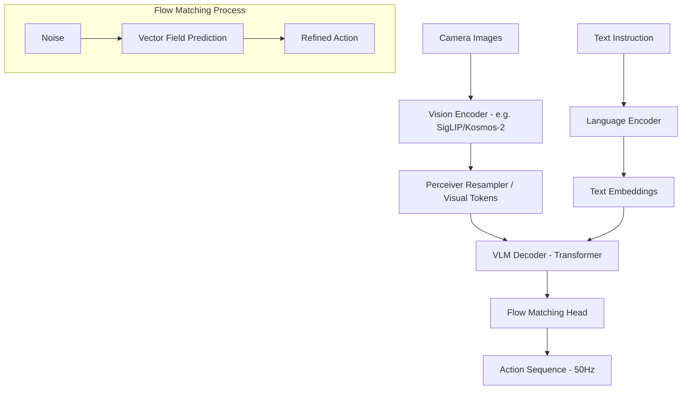

# MoNa-pi: Flow Matching 기반 차세대 Vision-Language-Action 모델

> **Motif**: [Physical Intelligence - π0 (Pi-zero)](https://www.physicalintelligence.company/blog/pi0)  
> **Concept**: Flow Matching을 이용한 실시간 고빈도 로봇 제어 및 다목적 VLA 모델 구축

---

## 🚀 프로젝트 개요

본 프로젝트는 기존의 이산 분류(Discrete Classification) 방식의 한계를 극대화하여, **Flow Matching(또는 Diffusion)** 기술을 기반으로 로봇의 부드럽고 정교한 움직임을 구현하는 차세대 VLA 모델을 구축하는 것을 목표로 합니다.

### 핵심 차별점 (vs. 기존 VLA)
1. **Flow Matching Action Head**: 9개의 방향성 클래스가 아닌, 연속된 액션 공간(Continuous Action Space)에서 최적의 경로를 직접 생성합니다.
2. **Action Chunking (Multi-step Prediction)**: 단일 프레임 예측이 아닌, 한 번에 미래의 N개(예: 16~50 step) 액션을 예측하여 제어 빈도를 50Hz 이상으로 끌어올립니다.
3. **Unified World Model (Option)**: 액션 뿐만 아니라 미래 시각적 토큰을 함께 예측하여 인지적 능력을 강화합니다.

---

## 🏗 시스템 아키텍처 (MoNa-pi)



---

## 📂 디렉토리 구조

```
MoNa-pi/
├── configs/            # 실험 및 모델 설정 (OmegaConf/JSON)
├── data/               # 데이터셋 로더 (HDF5, RLDS 지원)
│   ├── dataset.py
│   └── transforms.py
├── models/             # 핵심 모델 구현
│   ├── components/     # Resampler, Attention blocks
│   ├── heads/          # Flow Matching / Diffusion Heads
│   ├── backbones/      # VLM 백본 (SigLIP, Gemma, Kosmos 등)
│   └── pi0_core.py     # Main MoNa-pi Wrapper
├── training/           # 학습 루프 및 분산 학습 (HF Accelerate)
├── inference/          # 실시간 로봇 배포 및 추론 엔진
├── scripts/            # 유틸리티 (데이터 분석, 시각화)
└── README.md
```

---

## 🛠 실행 계획 (Phase 1)

1. **Base Infrastructure**: 기본 디렉토리 구조 및 `Flow Matching Head` 보일러플레이트 작성.
2. **Action Tokenizer**: 기존 H5 데이터를 연속값 또는 256-bin 토큰으로 변환하는 파이프라인 구축.
3. **Core Model Integration**: Kosmos-2 또는 선택된 VLM 백본에 Flow Matching 헤드 이식.
4. **Flow Matching Loss Logic**: `p_theta(a_t | s_t, g)` 형태의 Loss 함수 구현.

---

## 🏛 기술 스택
- **Language**: Python 3.10+
- **Deep Learning**: PyTorch + HuggingFace (Accelerate, Transformers)
- **Architecture**: Flow Matching / Diffusion Policy
- **Robotics**: ROS2 (Inference integration)
