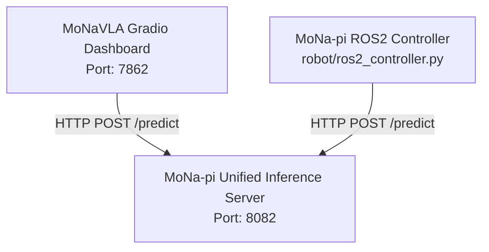

# MoNa-pi & MoNaVLA 추론 서버 호환성 가이드

MoNa-pi 통합 추론 서버(`inference/server.py`)는 **MoNa-pi 네이티브 API**와 **MoNaVLA 대시보드/클라이언트 API**를 모두 지원하여 단일 프로세스에서 호환되도록 설계되었습니다.

기존에 구동 중이던 MoNaVLA Gradio 대시보드를 그대로 새로고침(또는 재실행)하여 포트 `8082`로 설정된 MoNa-pi 서버와 즉시 연동할 수 있습니다.

---

## 1. 연결 구성도



---

## 2. MoNaVLA Gradio 대시보드 연결 방법

1. **MoNa-pi 추론 서버 실행 (8082 포트)**
   ```bash
   python3 inference/server.py --config configs/serbot2.yaml --ckpt checkpoints/best --port 8082
   ```

2. **MoNaVLA 대시보드 환경변수 설정 및 실행**
   `MoNaVLA` 레포지토리 경로로 이동한 뒤, `VLA_API_SERVER` 환경변수를 설정하여 대시보드를 실행합니다:
   ```bash
   cd /home/soda/MoNaVLA
   export VLA_API_SERVER=http://localhost:8082
   python3 scripts/gradio_inference_dashboard.py
   ```
   * *참고: 대시보드 UI가 이미 브라우저에 켜져 있는 상태라면 브라우저 페이지를 **새로고침(F5)**하여 연동할 수 있습니다.*

3. **대시보드 UI 설정**
   - **Backend Mode / 실험 모드**: `API Server` 선택
   - **서버 Config 상태**: 포트 8082 서버 정보가 정상적으로 로드되는지 확인

---

## 3. 실기동 순서 (`start.sh` 연동 최적화)

추론 서버(8082)가 실행된 상태에서 로봇 기동 스크립트를 수행하면 중복 기동 및 워밍업 대기 없이 즉시 연동됩니다:

```bash
# MoNa-pi-driving 폴더에서 실행
./start.sh hybrid
```

- 스크립트 내부에서 포트 `8082`가 사용 중임을 감지하여 **추론 서버 중복 실행 및 30초 워밍업 대기를 건너뛰고** 즉시 카메라 노드와 ROS2 컨트롤러 노드를 기동합니다.
- `SERVER_URL` 기본값이 `http://localhost:8082`로 지정되어 자동으로 연결됩니다.

---

## 4. API 호환성 스펙 요약

### [POST] `/predict` (추론 요청)
- **요청 바디 (Request)**
  - `image` (MoNaVLA 대시보드 전송 필드) 또는 `image_b64` (MoNa-pi 네이티브 필드) 모두 지원.
  - `instruction` (자연어 명령 텍스트)
- **응답 바디 (Response)**
  - `actions`: `list[list[float]]` (10×3 연속 액션 청크)
  - `chunk`: `list[list[float]]` (대시보드 2D Trajectory 그리기용 호환 필드)
  - `action_3d`: `list[float]` (대시보드 실시간 출력용 `[vx, vy, wz]`)
  - `goal_near_proxy`: `bool` (추론 결과가 `STOP`일 시 `True`로 반환되어 대시보드가 성공 종료를 감지함)
  - 기타 `model_name`, `strategy`, `source` 등 호환성 메타데이터 기본 포함.

### [GET] `/health` (헬스체크)
- 대시보드의 상태 표시등(Status Dot)과 연동할 수 있게 `"status": "healthy"` 및 GPU 메모리 정보를 반환합니다.

### [GET] `/model/info` (모델 정보 조회)
- 로드된 체크포인트 파일명, 디바이스, 액션 차원 등의 상태를 대시보드 UI에 출력합니다.
