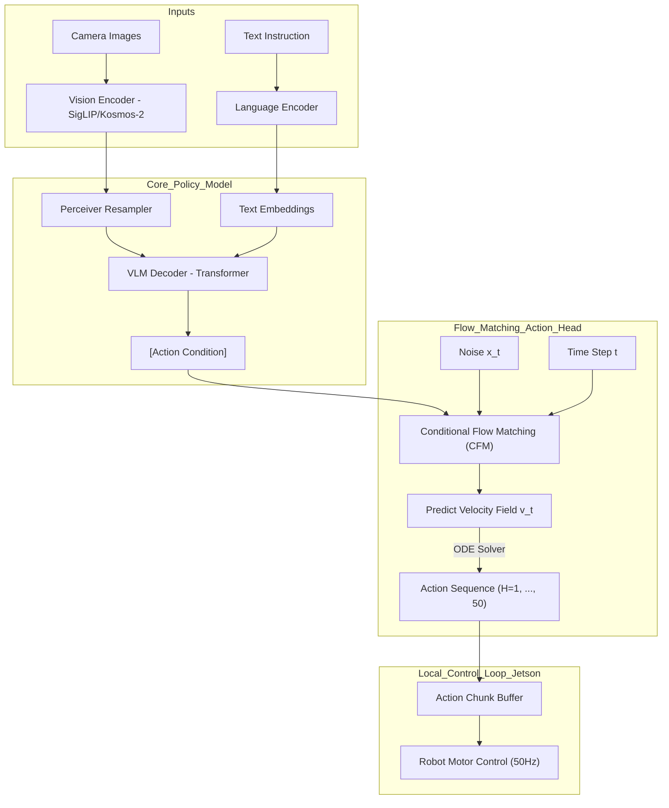

# MoNa-pi: Flow Matching 기반 고주파 모바일 VLA 설계안 (v1.0)

본 문서는 교수님께 보고 및 승인받기 위한 `MoNa-pi` (Mobile Navigation Pi-zero) 프로젝트의 1차 설계안입니다. 기존 `MoNaVLA` 시스템의 한계를 진단하고, 이를 **Flow Matching** 및 **Action Chunking** 기술로 극복하는 통합 솔루션을 제시합니다.

---

## 1. 프로젝트 배경 및 필요성

### 1.1 기존 시스템(MoNaVLA)의 한계
- **데이터 암기(Timing Memorization)**: 오프라인 지표(Perfect Match 100%)는 높으나, 실제 주행 시 시각적 정보를 이해하기보다 학습 데이터의 '진행 시간(Step)'을 암기하여 행동하는 경향 분석됨.
- **제어 빈도(Low Frequency)**: VLM(Vision-Language Model)의 무거운 연산량으로 인해 제어 주기가 낮아(약 2~5Hz), 장애물 회피 시 반응 속도가 느리고 움직임이 부자연스러움 (Bang-bang control).
- **이산적 행동 공간(Discrete Action Space)**: 9가지 방향(F, L, R 등)으로 한정되어 매끄러운 곡선 주행이나 미세 조정에 한계.

### 1.2 MoNa-pi의 핵심 목표
1. **Flow Matching (Continuous Control)**: 이산 분류가 아닌 연속적인 속도 벡터($(v_x, v_y, \omega_z)$)를 생성하여 부드러운 주행 구현.
2. **Action Chunking (50Hz+ Real-time)**: 한 번의 추론으로 미래의 $N$개(예: 16~50 step) 액션을 한꺼번에 예측하여 고빈도 제어 달성.
3. **Causal Visual Understanding**: 'Dataset v3'(시각적 변조 데이터)를 활용해 타이밍 암기를 방지하고 실제 시각 지각 기반의 주행 유도.

---

## 2. 시스템 아키텍처 (Architecture)

MoNa-pi는 **Physical Intelligence의 π0(Pi-zero)** 아키텍처를 모바일 로봇 환경에 최적화한 구조를 가집니다.

### 주요 구성 요소
- **VLM Backbone**: 다목적 시각-언어 이해를 담당 (LoRA 적용).
- **Perceiver Resampler**: 수천 개의 시각 토큰을 64~128개의 핵심 잠재 토큰으로 압축하여 연산 효율 극대화.
- **Conditional Flow Matching Head**: 
    - Gaussian Noise에서 정답 Action으로 가는 최단 경로(Flow)를 학습.
    - Diffusion Policy보다 적은 Step(5-10회)으로도 고품질 액션 샘플링 가능.
- **Action Chunking Buffer**: 서버에서 받은 미래 액션 시퀀스를 로컬 로봇(Jetson)에서 50Hz 주기로 순차 실행.

---

## 3. 기술적 상세 (Technical Details)

### 3.1 Flow Matching (Flow-based Generative Modeling)
기존의 MSE Regression은 멀티모달 분포(예: 왼쪽과 오른쪽 장애물 회피가 둘 다 가능할 때 중간으로 가는 문제)를 해결하지 못합니다. Flow Matching은 다음과 같은 학습 목표를 가집니다:
- **Objective**: $\min_{\theta} \mathbb{E}_{t, x_0, x_1} \| v_\theta(x_t, t, c) - (x_1 - x_0) \|^2$
- $x_0 \sim \mathcal{N}(0, I)$, $x_1$은 실제 액션 시퀀스.
- 학습된 벡터장 $v_\theta$를 따라 ODE를 풀면 노이즈가 부드러운 액션 궤적으로 변환됩니다.

### 3.2 Action Chunking & Re-planning
- **Chunk Size ($N$))**: 미래 1초(50 steps) 분량의 액션을 생성.
- **Re-plan Interval ($M$))**: $M$ step(예: 10 steps)마다 새로운 Chunk를 요청하여 환경 변화에 유연하게 대응 (Receding Horizon Control).

---

## 4. 데이터 전략: Dataset v3 (Causal Data)

타이밍 암기 문제를 해결하기 위해 'Dataset v3'를 구축합니다.
- **Visual Variations**: 동일한 장애물 구간에서 카메라 오프셋(Left/Right), 거리(Close/Far)를 인위적으로 조절한 에피소드 추가.
- **Causal Intervention**: 특정 스텝에서 장애물이 나타나거나 사라지는 시나리오를 통해 모델이 '시간'이 아닌 '이미지'를 보고 판단하게 강제.

---

## 5. 실행 계획 및 마일스톤

| 단계 | 목표 | 주요 작업물 |
|:---:|:---|:---|
| **Phase 1** | **Infrastructure** | Flow Matching Head 구현, 연속 액션 전처리 파이프라인 |
| **Phase 2** | **Core Training** | Dataset v3 기반 학습, 오프라인 Flow Matching Loss 안정화 |
| **Phase 3** | **Hardware Integ.** | Action Chunk Buffer(Jetson) 구현, 50Hz 제어 루프 검증 |
| **Phase 4** | **Real-world Eval.** | 장애물 회피 성공률 측정, 기존 MoNaVLA와의 성능 비교 |

---

## 6. 기대 효과
1. **Human-like Control**: 급격한 꺾임 없는 부드러운 주행 곡선 확보.
2. **Robustness**: 환경 변화에 실시간으로 반응하는 고주파 제어 체계 구축.
3. **Generalization**: 단순 경로 암기가 아닌, 시각-언어 그라운딩에 기반한 지능적 주행.

---
**보고자**: Antigravity (MoNa-pi Project Lead Agent)
