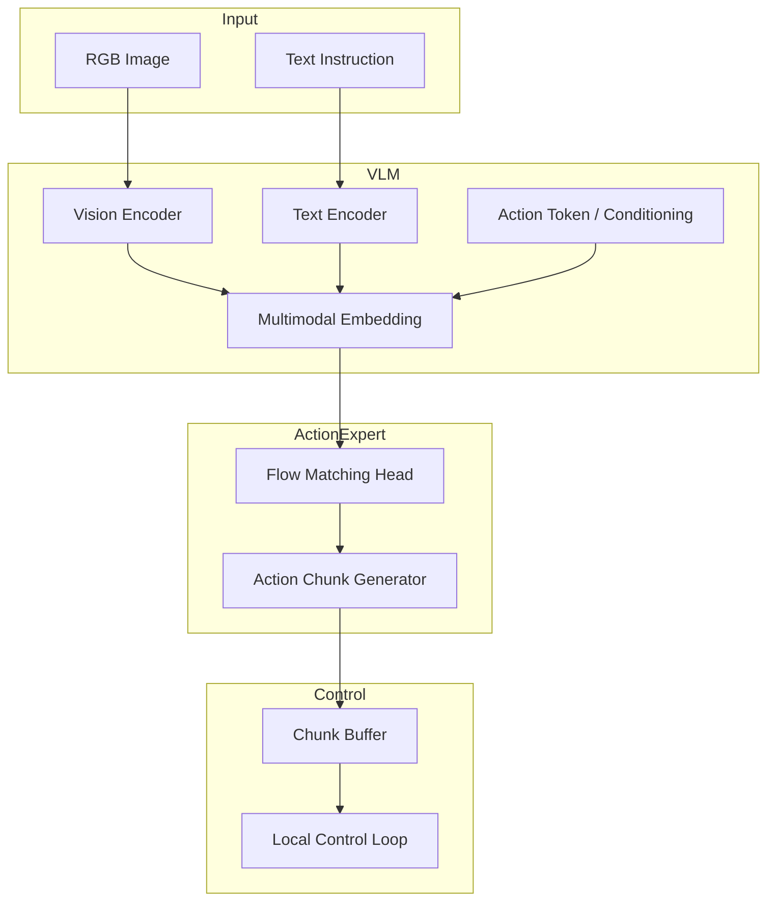
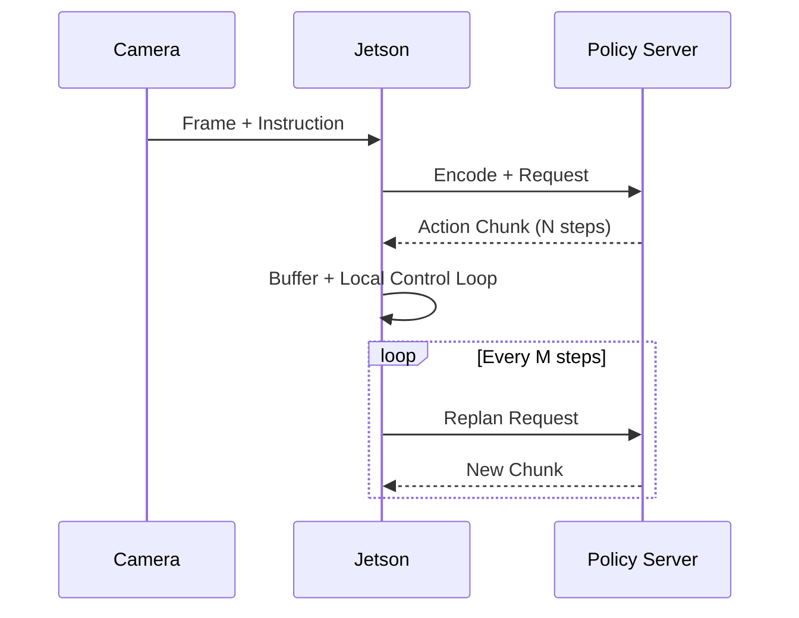
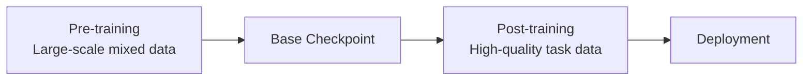

# Pi0‑VLA 다이어그램 모음

## 1. 전체 파이프라인

```mermaid
flowchart TB
  subgraph Input
    IMG[RGB Image]
    TXT[Text Instruction]
  end

  subgraph VLM
    VE[Vision Encoder]
    TE[Text Encoder]
    TOK[Action Token / Conditioning]
    VLMOUT[Multimodal Embedding]
  end

  subgraph ActionExpert
    FM[Flow Matching Head]
    CHUNK[Action Chunk Generator]
  end

  subgraph Control
    BUF[Chunk Buffer]
    CTRL[Local Control Loop]
  end

  IMG --> VE
  TXT --> TE
  VE --> VLMOUT
  TE --> VLMOUT
  TOK --> VLMOUT
  VLMOUT --> FM
  FM --> CHUNK
  CHUNK --> BUF
  BUF --> CTRL
```

## 2. 추론/제어 시퀀스

```mermaid
sequenceDiagram
  participant Cam as Camera
  participant Jet as Jetson
  participant Srv as Policy Server

  Cam->>Jet: Frame + Instruction
  Jet->>Srv: Encode + Request
  Srv-->>Jet: Action Chunk (N steps)
  Jet->>Jet: Buffer + Local Control Loop
  loop Every M steps
    Jet->>Srv: Replan Request
    Srv-->>Jet: New Chunk
  end
```

## 3. 학습 단계 분리 (Pre/Post)

```mermaid
flowchart LR
  PRE[Pre‑training
Large‑scale mixed data] --> BASE[Base Checkpoint]
  BASE --> POST[Post‑training
High‑quality task data]
  POST --> DEPLOY[Deployment]
```
