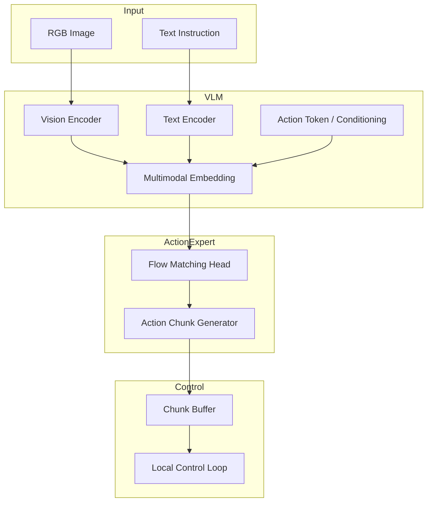
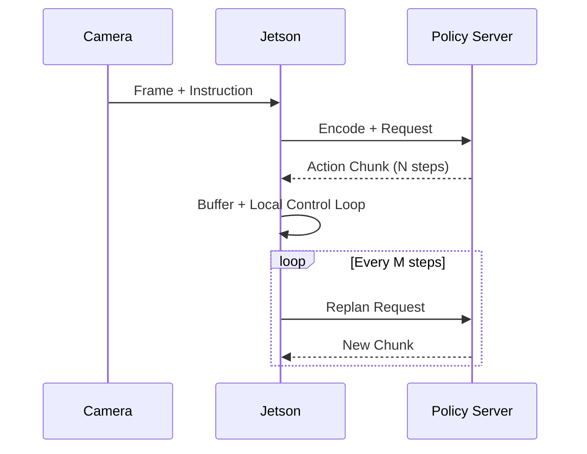

# Pi0‑VLA 구현 설계 문서 (초안)

이 문서는 `MoNa-pi` 레포 구조를 기준으로 Pi0 원칙을 구현으로 옮기기 위한 설계 초안이다. Pi0 논문과 openpi README의 핵심 원칙을 구현 계획으로 변환했다.

---

## 1. 설계 목표

- Flow Matching 기반 연속 액션 생성 헤드 구축
- action chunking을 통해 고주파(50Hz+) 제어 경로 제공
- 사전학습 + 후속학습 분리 전략을 파이프라인에 반영
- 데이터 편향(타이밍 암기) 최소화를 위한 데이터 규약 도입

---

## 2. 시스템 아키텍처

---

## 3. 모듈별 구현 계획

### 3.1 `models/heads/`

- `flow_matching_head.py` 추가
- 입력: VLM의 멀티모달 embedding (또는 `[LRN]` token hidden state)
- 출력: `(B, L, N, action_dim)` 형태의 연속 액션 chunk
- Loss: Flow Matching loss (주손실) + 보조 지표(MSE/Direction match) 로그

### 3.2 `data/`

- 연속 액션 스케일링 규칙 고정
- Dataset v3 변형(상태 다양화) 반영
- episode 기반 split 규약 문서화

### 3.3 `training/`

- Flow Matching loss 및 스케줄러 통합
- pre‑training / post‑training 모드 분리
- 실험 행렬: chunk 길이 vs 성능 vs 제어 안정성

### 3.4 `inference/`

- chunk buffer + 재계획 주기 로직 구현
- 고주파 제어 루프는 Jetson 측에서 유지
- 서버는 chunk 생성만 담당

---

## 4. 데이터/학습 레시피

### 4.1 사전학습 (Pre‑training)

- 목적: 일반화 능력 확보
- 데이터: 가능한 범위에서 multi‑task, multi‑environment 확장

### 4.2 후속학습 (Post‑training)

- 목적: 특정 환경에서 성능/안정성 강화
- 데이터: 고품질, low‑noise, task‑specific

---

## 5. 추론 및 제어 경로

---

## 6. 검증 계획

- 오프라인 비교: MoNaVLA vs Pi0‑VLA 동일 데이터셋 평가
- 시각 다양성 테스트: 타이밍 암기 민감도 측정
- 실로봇 평가: 성공률/충돌률/지터 측정
- 제어 주기: 50Hz+ 유지 여부 실측

---

## 7. 오픈 이슈

- action chunk 길이 N과 재계획 주기 M의 최적 조합
- Flow Matching loss 안정화 전략
- 데이터 규모 격차(π0 수준 데이터 vs 현 데이터)
